<p align="center">
  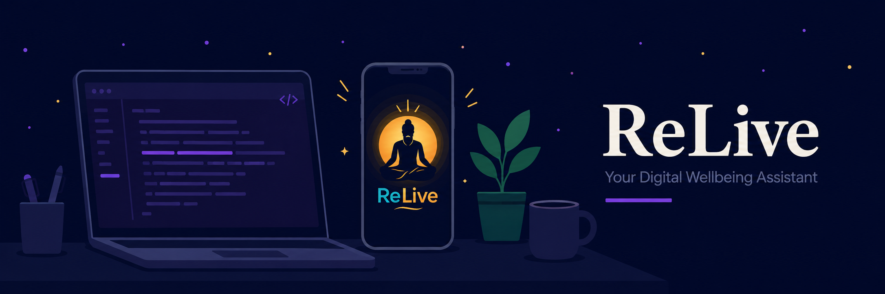
</p>

# ReLive — Digital Wellbeing & Parental Control App

> Reclaim control over technology. Build healthier digital habits.


---

## Table of Contents
- [Overview](#overview)
- [Account & Profile](#account--profile)
- [Home & Parent Mode](#home--parent-mode)
- [Wellness Tab](#wellness-tab)
- [Commit Tab & AI Coach](#commit-tab--ai-coach)
- [Architecture](#architecture)
- [Project Structure](#project-structure)
- [Development Roadmap](#development-roadmap)
- [Tech Stack](#tech-stack)
- [Getting Started](#getting-started)
- [Known Limitations](#known-limitations)
- [Developer](#developer)
- [License](#license)

---

## Overview

ReLive is an AI-powered digital wellbeing ecosystem for Android that helps users:

- Track and manage screen time with a real-time dashboard
- Enable parental controls with password protection
- Set daily screen time limits with alerts
- View daily and weekly usage reports with charts
- Stay productive with Focus Mode and Study Mode (Pomodoro)
- Track water intake, sleep, mood, and BMI/fitness
- Build healthy routines with a habit tracker
- Get guidance from an AI Coach
- Maintain a cloud-synced profile — sign in and pick up right where you left off, on any device

Inspired by Google Digital Wellbeing, Apple Screen Time, Forest, and Family Link, combined into one platform.

---

## Account & Profile
 

Email/password authentication with mandatory email verification — accounts can't skip this step, so every user in the system is confirmed to own the email they signed up with. Forgot Password is handled through Firebase's own reset-link flow. Profile name and photo are editable and synced to Cloud Firestore in real time, so a change made on one device shows up on another instantly. Firestore security rules restrict every profile document to its own owner.

<table>
<tr>
<td width="33%">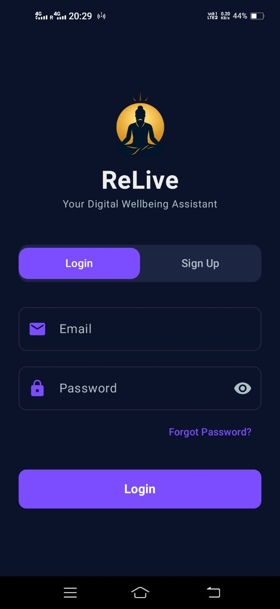</td>
<td width="33%">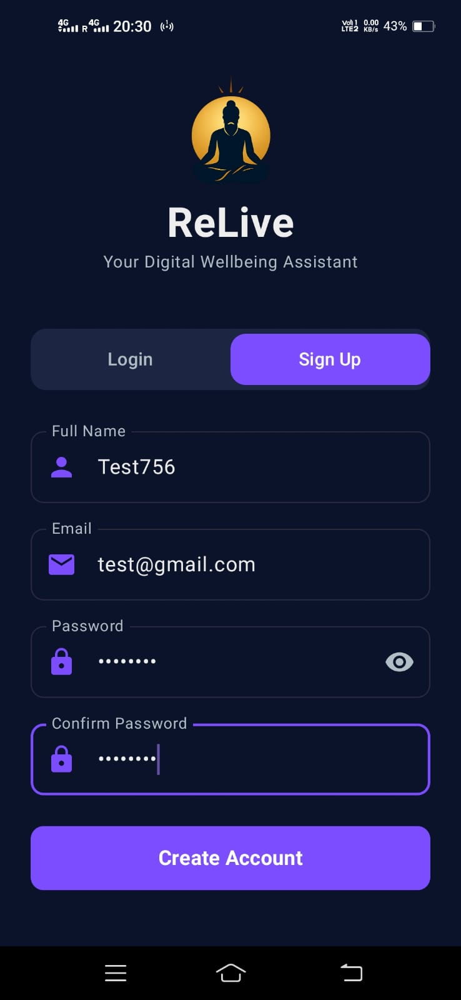</td>
<td width="33%">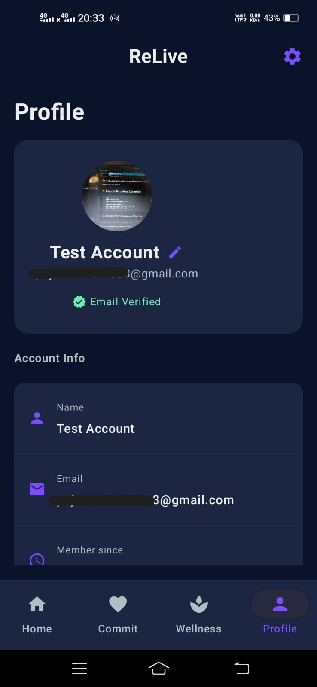</td>
</tr>
<tr>
<td align="center">Login with Forgot Password</td>
<td align="center">Sign Up</td>
<td align="center">Editable Profile</td>
</tr>
</table>

---

## Home & Parent Mode


The home screen gives a quick activity log and a Parent Mode toggle. Parent Mode is protected by a password hashed with SHA-256 and stored via Android's EncryptedSharedPreferences (never in plain text), and runs as a Foreground Service with a persistent notification while active.

<table>
<tr>
<td width="50%">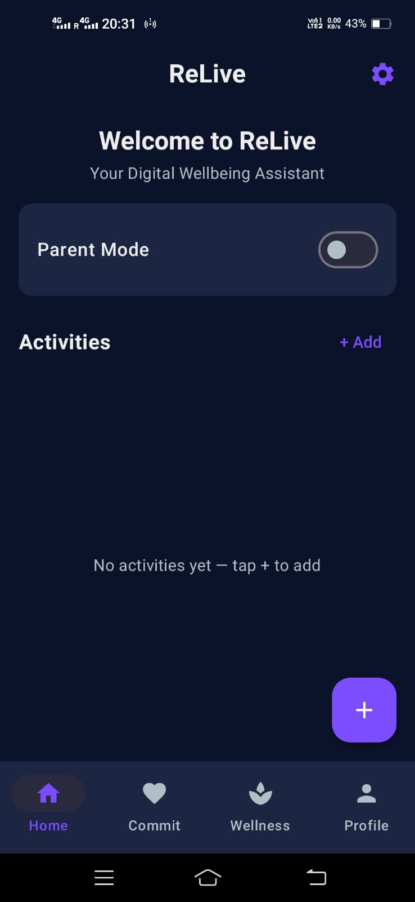</td>
<td width="50%">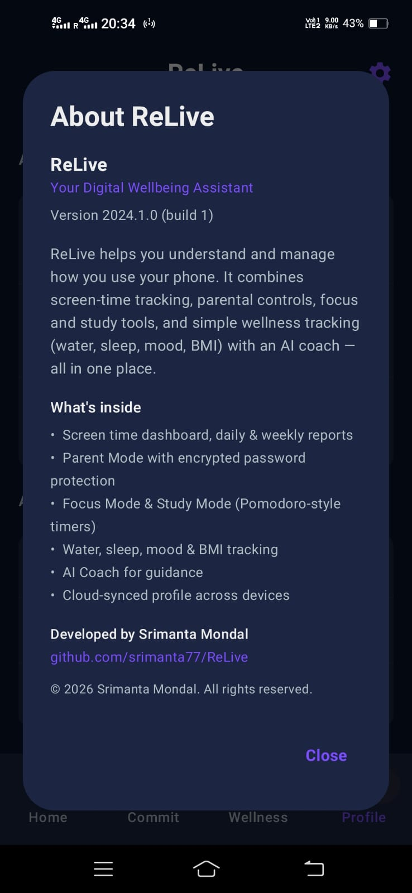</td>
</tr>
<tr>
<td align="center">Home Screen</td>
<td align="center">About ReLive</td>
</tr>
</table>

---

## Wellness Tab


A real-time screen time dashboard (today's total, per-app breakdown) sits alongside daily/weekly report views and configurable screen-time limits. Beyond screen time, this tab also covers simple wellness tracking — water intake, sleep, mood, and BMI — read directly from Android's official Usage Access API, nothing scraped or inferred.

<table>
<tr>
<td width="33%">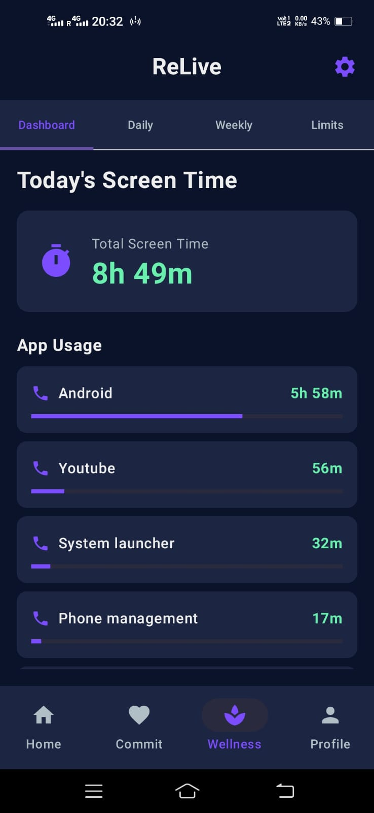</td>
<td width="33%">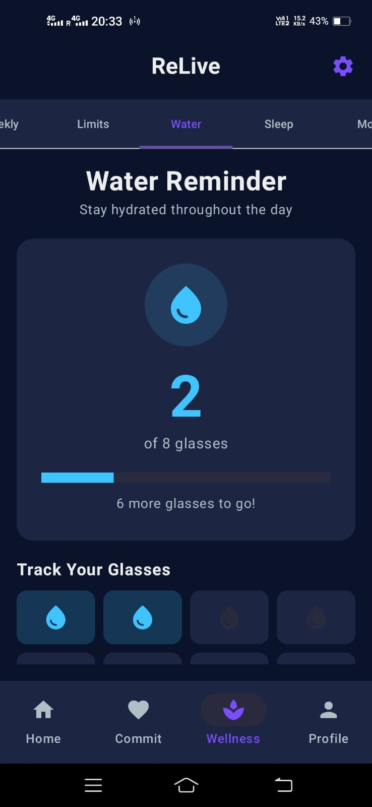</td>
<td width="33%">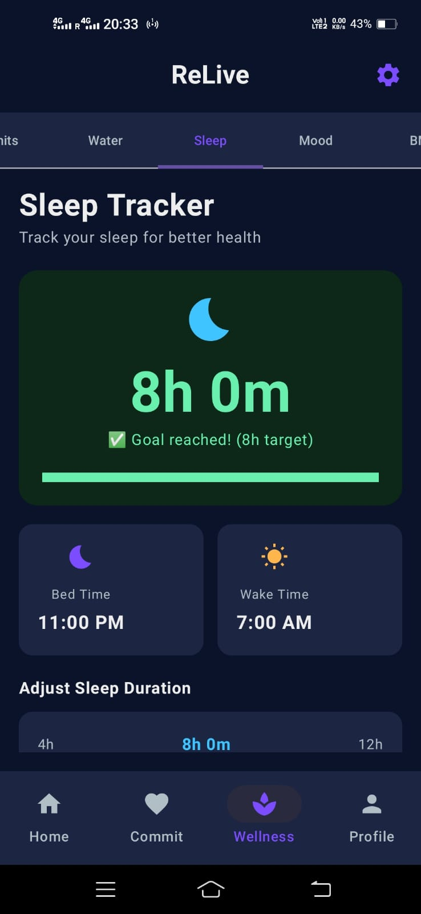</td>
</tr>
<tr>
<td align="center">Screen Time Dashboard</td>
<td align="center">Water Reminder</td>
<td align="center">Sleep Tracker</td>
</tr>
</table>

<table>
<tr>
<td width="33%">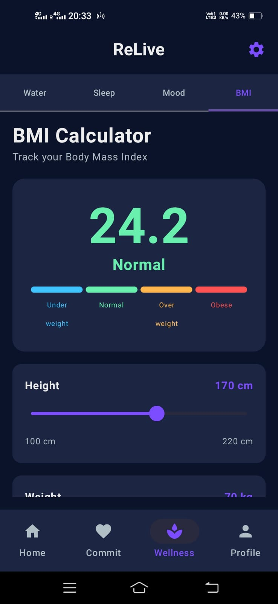</td>
</tr>
<tr>
<td align="center">BMI Calculator</td>
</tr>
</table>

---

## Commit Tab & AI Coach

Focus Mode and Study Mode bring Pomodoro-style timers with session history, and a daily Habit Tracker keeps recurring goals visible. The AI Coach ties it together — a conversational assistant that can reference your screen time and wellness data to give grounded suggestions rather than generic advice.

<table>
<tr>
<td width="33%">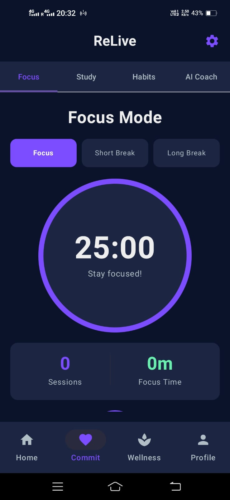</td>
<td width="33%">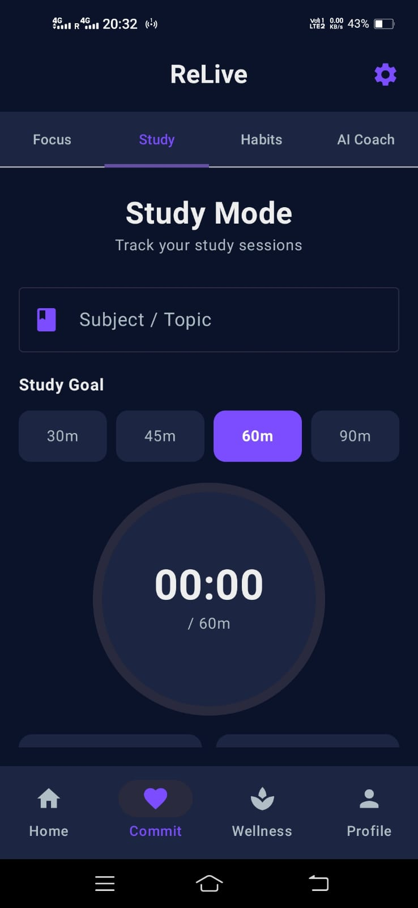</td>
<td width="33%">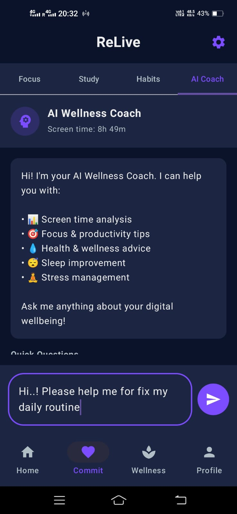</td>
</tr>
<tr>
<td align="center">Focus Mode</td>
<td align="center">Study Mode</td>
<td align="center">AI Coach</td>
</tr>
</table>

---

## Architecture

```
UI (Jetpack Compose + Material 3)
        ↓
ViewModel (StateFlow + SharedFlow)
        ↓
Repository
        ↓
Room Database (SQLite) + DataStore   |   Firebase Auth + Firestore
```

**Pattern:** MVVM (Model-View-ViewModel)
**Async:** Kotlin Coroutines + Flow
**Security:** EncryptedSharedPreferences, ProGuard, Firestore security rules
**Cloud:** Firebase Authentication, Cloud Firestore (real-time sync)

---

## Project Structure

```
app/src/main/java/in/srimantamondal/relive/
│
├── data/
│   ├── db/           → Room Database, DAO
│   ├── model/        → ActivityRecord, UserProfile
│   ├── repository/   → ReLiveRepository, UserProfileRepository (Firestore)
│   └── usage/        → AppUsageManager, ScreenTimeLimitManager
│
├── ui/
│   ├── screens/      → HomeScreen, AuthScreen, EmailVerificationScreen,
│   │                    ProfileScreen, UsageDashboard, DailyReport,
│   │                    WeeklyReport, ScreenTimeLimit, ParentModeSettings,
│   │                    FocusModeScreen, StudyModeScreen, HabitTrackerScreen,
│   │                    WaterReminderScreen, SleepTrackerScreen,
│   │                    MoodTrackerScreen, BMICalculatorScreen, AICoachScreen
│   ├── theme/        → Material 3 colors, typography
│   ├── HomeViewModel.kt
│   └── UsageStatsHelper.kt
│
├── security/
│   └── PasswordManager.kt   → EncryptedSharedPreferences
│
├── parent/
│   └── ParentModeService.kt → Foreground Service
│
├── MainActivity.kt   → Auth-state routing (logged out / needs verification / logged in)
└── SplashActivity.kt
```

---

## Development Roadmap

| Phase | Feature | Status |
|-------|---------|--------|
| Phase 1 | Foundation, MVVM, Room, DataStore, Splash, Navigation | Complete |
| Phase 2 | Parent Mode, Foreground Service, Security, Settings | Complete |
| Phase 3 | Usage Tracking, Screen Time Dashboard, Daily/Weekly Reports, Limits | Complete |
| Phase 4 | Focus Mode, Study Mode, Habit Tracker | Complete |
| Phase 5 | Health System — Water Reminder, Sleep, Mood, BMI | Complete |
| Phase 6 | AI Coach | Complete |
| Phase 7 | Firebase Auth, Enforced Email Verification, Forgot Password, Profile Editing, Firestore Cross-device Sync | Complete |
| Phase 8 | App Signing, Custom Branding, Play Store Release | In Progress |

---

## Tech Stack

| Category | Technology |
|----------|-----------|
| Language | Kotlin |
| UI | Jetpack Compose, Material 3 |
| Architecture | MVVM |
| Local Database | Room (SQLite) |
| Preferences | DataStore |
| Cloud Auth & DB | Firebase Authentication, Cloud Firestore |
| Security | EncryptedSharedPreferences, SHA-256, ProGuard, Firestore Security Rules |
| Async | Coroutines, Flow |
| Service | Android Foreground Service |
| Usage Tracking | Android UsageStatsManager |
| Future | AI APIs, Firebase Cloud Functions |

---

## Getting Started

### Install the app (no build required)
1. Go to the [Releases](https://github.com/srimanta77/ReLive/releases) page and download the latest `app-release.apk`
2. On your Android phone, go to **Settings → Apps → Special access → Install unknown apps**, and allow it for the browser or Files app you'll install from
3. Open the downloaded APK file and tap **Install**
4. Launch ReLive and sign up

### Build from source

**Prerequisites**
- Android Studio Hedgehog or later
- Android SDK 34 (compileSdk / targetSdk)
- Kotlin 2.0+
- Min SDK: 24 (Android 7.0)
- A Firebase project with Authentication (Email/Password) and Firestore enabled — add your own `google-services.json` under `app/`

```bash
git clone https://github.com/srimanta77/ReLive.git
cd ReLive
# Open in Android Studio and run on device/emulator
```

### Permissions Required
- `FOREGROUND_SERVICE` — Parent Mode background service
- `POST_NOTIFICATIONS` — Parent Mode notification (Android 13+)
- `PACKAGE_USAGE_STATS` — Screen time tracking (manual grant required)
- Internet — Firebase Authentication and Firestore sync

---

## Known Limitations

- Not yet published on Google Play — Phase 8 (signing, listing, submission) is in progress
- Verification/reset emails currently send from Firebase's default sender and may land in spam until a custom domain sender is configured
- AI Coach responses depend on an external API key configured at build time

---

## Developer

**Srimanta Mondal**
Assistant Professor, Computer Science & Engineering — Dev Bhoomi Uttarakhand University
Teaches Cybersecurity & Digital Forensics | Android Developer | Entrepreneur

[](https://github.com/srimanta77)
[](https://srimantamondal.in)

---

## License

© 2026 Srimanta Mondal. All Rights Reserved.

This repository is public for portfolio and educational viewing only. See [LICENSE](LICENSE) for full terms — copying, modifying, or redistributing this code without written permission is not allowed.
